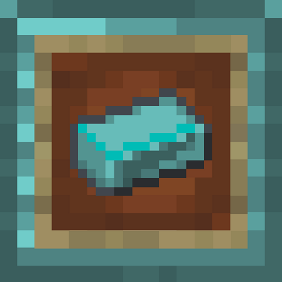

# The Speedrunner Mod (for Fabric)

A Minecraft mod that makes Speedrunning, easier.

---

## Installation

You can download the Speedrunner Mod [here](https://www.curseforge.com/minecraft/mc-mods/speedrunner-mod). You will also need to download the [fabric installer](https://fabricmc.net/use/) in order to run the mod. Fabric API is NOT required, but you can use it if you would like, unless you want to submit official speedruns.
